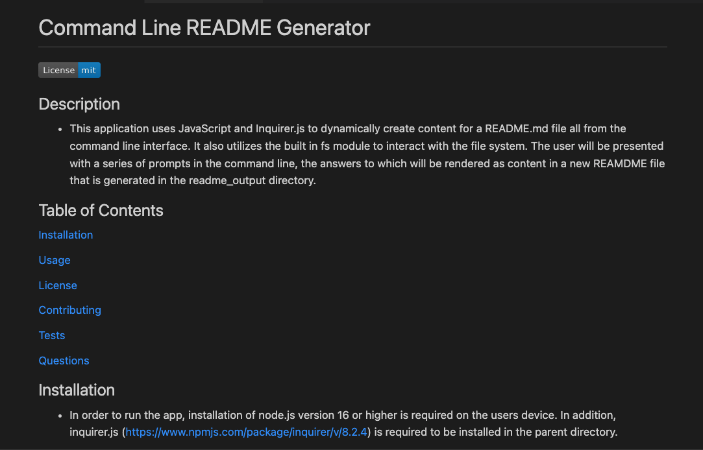

# Command Line README Generator    
  

  ## Description
  - This application uses JavaScript and Inquirer.js to dynamically create content for a README.md file all from the command line interface.  It also utilizes the built in fs module to interact with the file system.  The user will be presented with a series of prompts in the command line, the answers to which will be rendered as content in a new REAMDME file that is generated in the readme_output directory.
  

  ## Table of Contents
  [Installation](#installation)

  [Usage](#usage)

  [License](#license)

  [Contributing](#contributing)

  [Tests](#tests)

  [Questions](#questions)

  ## Installation
  - In order to run the app, installation of node.js version 16 or higher is required on the users device. In addition, inquirer.js (https://www.npmjs.com/package/inquirer/v/8.2.4) is required to be installed in the parent directory. 
  ## Usage
  - This application saves time for developers who want to create a README file quickly and uniformly based on a template. The app serves as the template prompting the user to answer a series of quesitons that are required for output.  Access is via the integrated Command Line Terminal interface.  Please see link for video on proper installation and usage of the application. 

  (https://bootcampspot.instructuremedia.com/embed/7f216437-9a25-4217-bdb2-e67294d2a799)

  ## Contributing
  - Other developers may contribute to this project by expanding on the questions array of prompts and also expanding on the types of inputs fromt the user. Asking the user to qualify whether or not they wish to include certain information and using those boolean values to append or not the data. In addition, it would be a more scalable app to remove the hardcoding of the license links for Apache 2.0 and GNU 3.0 and instead create an additional level of text conversion and use the template literal to fill in the link information of each.
  ## Tests
  - At this time there are no test files to run.  A preview may be generated by moving through the prompts in the command line.
  ## Questions
  - Please visit my GitHub profile for further information about this project (https://github.com/AltB22).  The project repository can be found on GitHub as well (https://github.com/AltB22/Command_Line_README_Generator)
  - Please email altbcodes@gmail.com with additional quesitons.
  ## License
  - This application is covered under the 